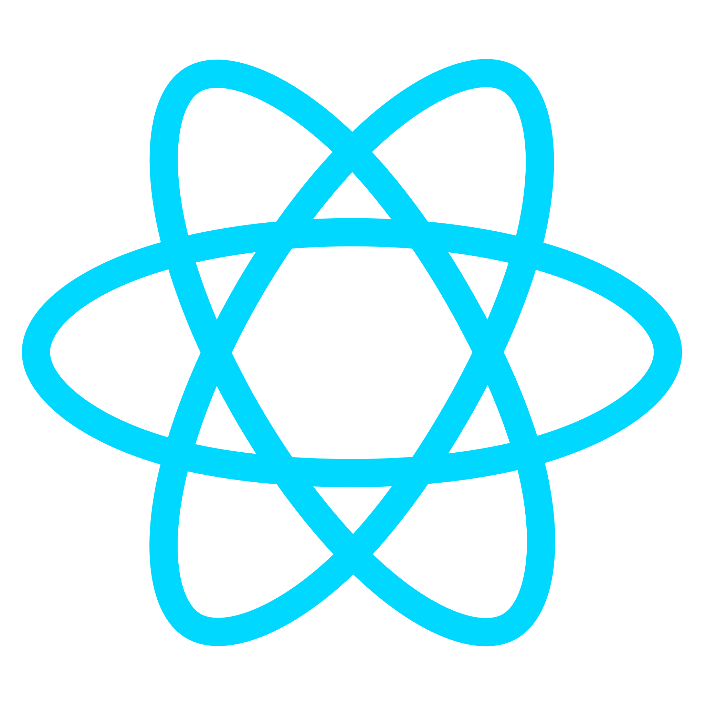
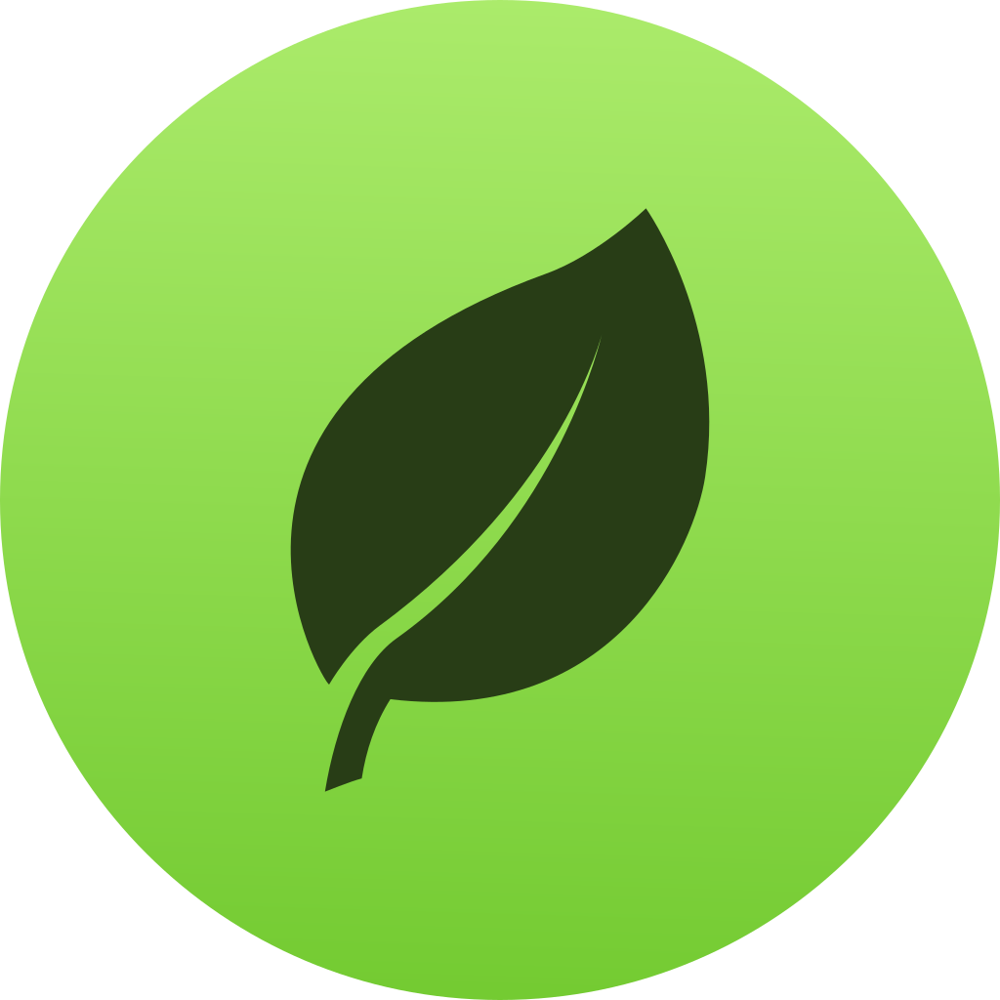
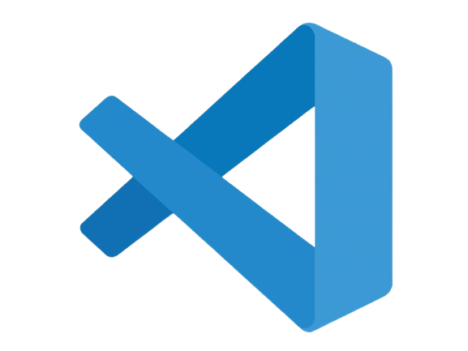
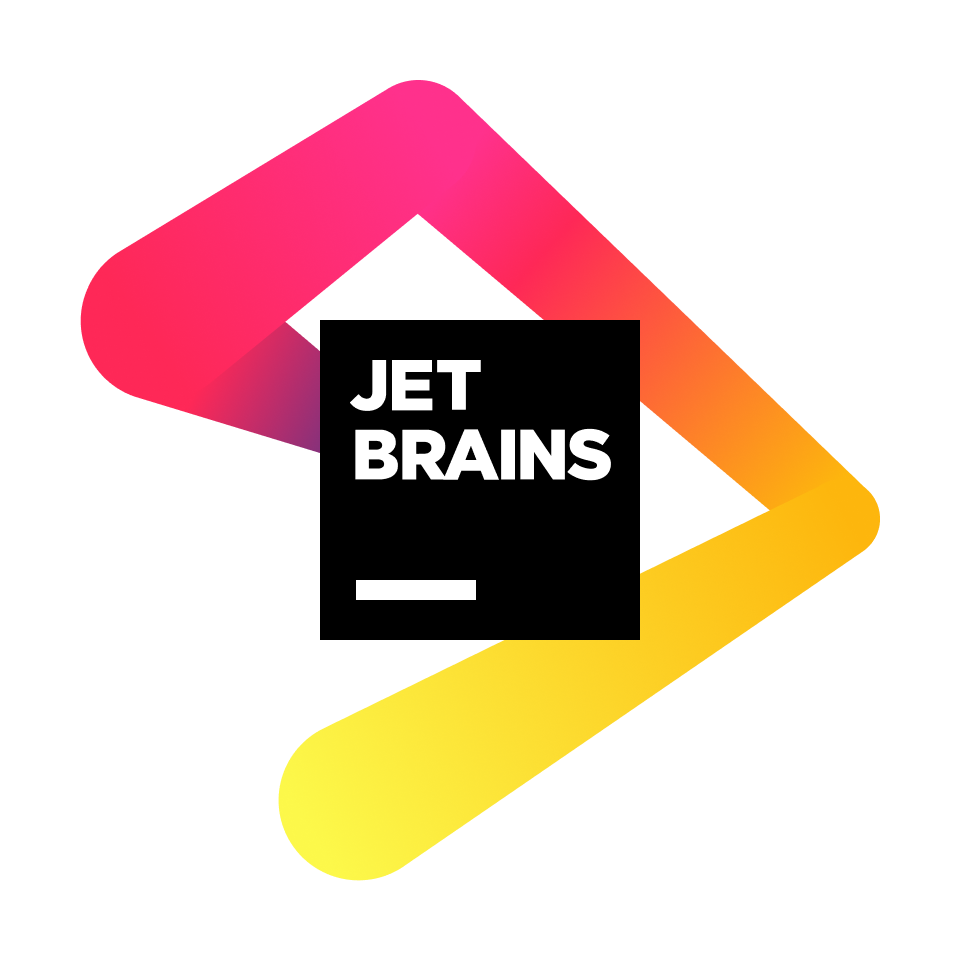
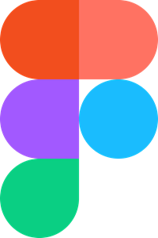
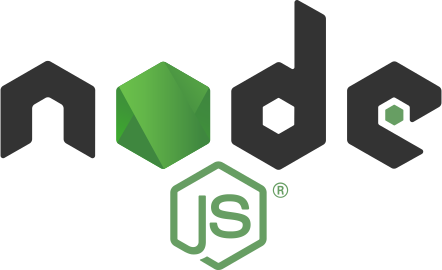
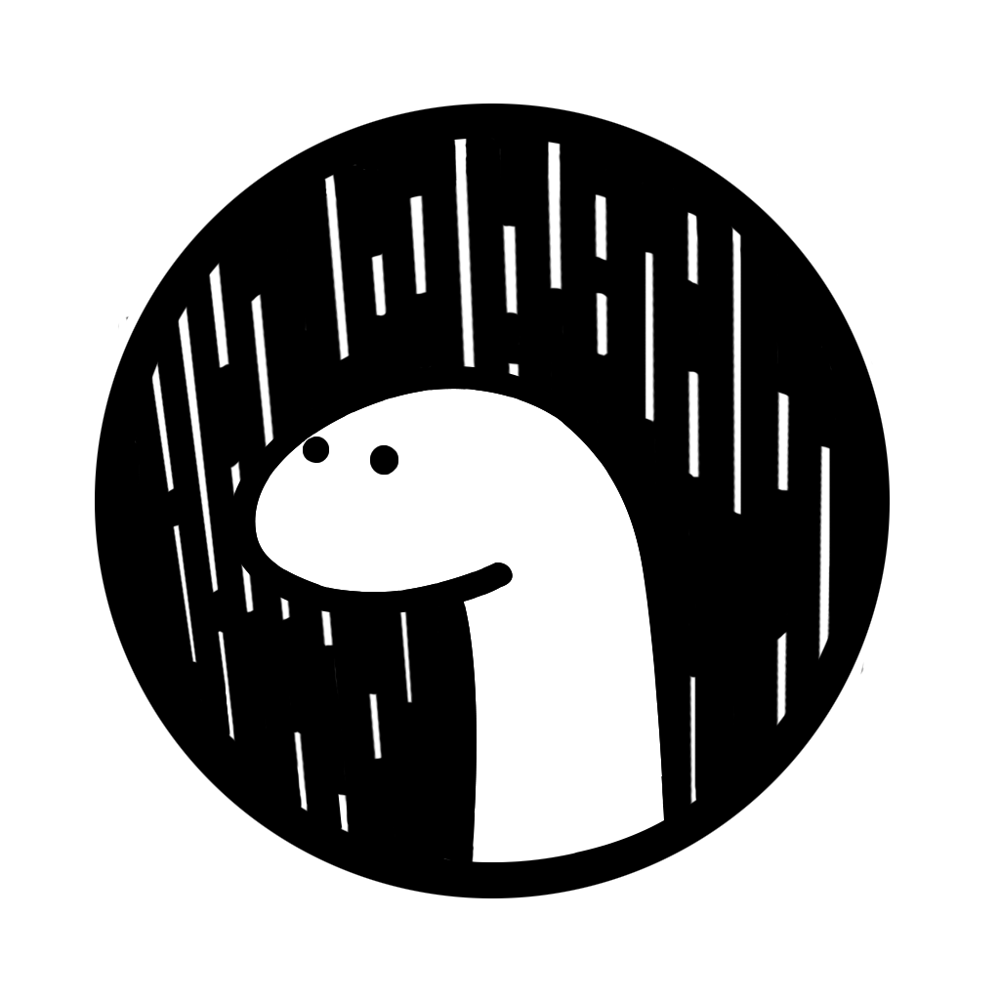

  <h2 align="center">Yo, Wassup ✌️, I'm Doston </h2>

 

  

<h2> I'm a Software Engineer from Uzbekistan. </h2>
 
 - 🔭 Currently working as a <b> Open Source contributor </b> 
    - 🌱 Currently learning <b> Rust and Nixos </b> 
    - 💬 Feel free to give any question related to <b>IT</b>   
    - ✌ My website: <a href="https://kisuke.uz">kisuke.uz</a>
    

 
 
 
 

 

# 🔨 Languages and Tools:

 
 

  
  

## 💬 Contact with me via:

<!--  -->

  

## ⚜ Doston' stats:
c    
 

